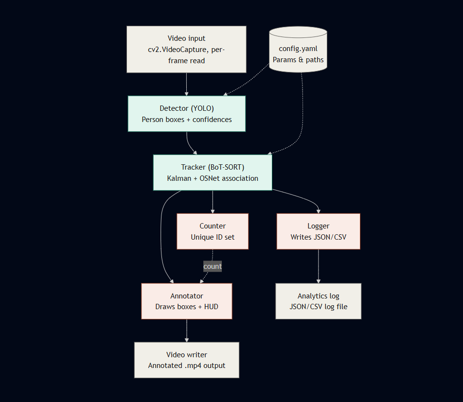

# Real-Time MOT & Crowd Analytics Pipeline


Detects, tracks, and counts unique people in crowded video using **YOLO** (detection) + **BoT-SORT with OSNet ReID** (tracking).



---
---
## Demo

https://github.com/HarshaPriya03/MOT_and_CrowdAnalytics/blob/main/outputs/result.mp4
---

## Setup

```bash
git clone https://github.com/HarshaPriya03/MOT_and_CrowdAnalytics
cd MOT_and_CrowdAnalytics

python -m venv venv
venv\Scripts\activate        # Windows
source venv/bin/activate     # macOS/Linux

# python should be >= 3.10 and < 3.14
#my python version is 3.13.5

pip install -r requirements.txt
```

> YOLO weights and OSNet ReID weights are auto-downloaded on first run (needs internet once).

---

## Running it

```bash
python main.py --input test.mp4 --output outputs\result.mp4 --model yolov8m.pt
```

Optional overrides: `--model`, `--device`, `--conf`, `--iou`, `--log-format`.

All other settings (thresholds, occlusion tolerance, output format, etc.) live in `config.yaml` — nothing is hardcoded in the source.

**Output:**
- Annotated video at `--output` path
- `outputs/analytics_log.json` — frame-by-frame track data + run summary

---

## Model Choice: YOLOv8n vs YOLOv8m

I tested both YOLOv8n and YOLOv8m on the same 422-frame clip with identical tracker settings to see if the bigger model was worth the extra processing cost.

### Results

| Metric | YOLOv8n | YOLOv8m |
|---|---|---|
| Speed | ~1 fps | ~0.5 fps |
| Most people seen at once | 52 | 48–52 |
| Total unique IDs | 168 | 148–155 |
| Churn ratio* | 3.23 | 2.85–3.23 |

<sub>Churn ratio = total unique IDs / peak concurrent people :- a proxy for how much ID fragmentation is happening overall, not just direct switches. YOLOv8m was run twice with identical settings; the range reflects normal run-to-run variance in tracker/ReID matching, not a config difference.</sub>

### What is churn ratio?

I divided total unique IDs by peak concurrent people to get a rough idea of how many times the same person gets counted multiple times. It's not perfect, but it gives a general sense of how messy the tracking is.

### Why two runs for YOLOv8m?

I ran YOLOv8m twice to make sure the results were consistent. The small difference between runs (148–155) is normal variation, not because I changed any settings.

### What this means

Before switching models, I tried adjusting tracker thresholds to reduce ID switching, but nothing really improved the churn ratio without also losing people. So I tried YOLOv8m instead, which gave better ID stability at the cost of speed.

The bigger model does give slightly better ID stability in its best run, it kept the same peak headcount (52) as YOLOv8n but produced fewer duplicate IDs (148 vs 168). This likely happens because YOLOv8m gives more consistent detection confidence frame-to-frame, so the tracker's matching step has cleaner input to work with.

But it runs at half the speed — ~0.5 fps vs ~1 fps on CPU. That's a big slowdown for a modest tracking improvement.

### My decision

I went with **YOLOv8m**. It runs slower (about half the speed of YOLOv8n on my CPU), but it gave more stable people-tracking, which matters more for an accurate headcount than raw speed. On a GPU, the speed difference would matter much less, so this trade-off would be an even easier call.
